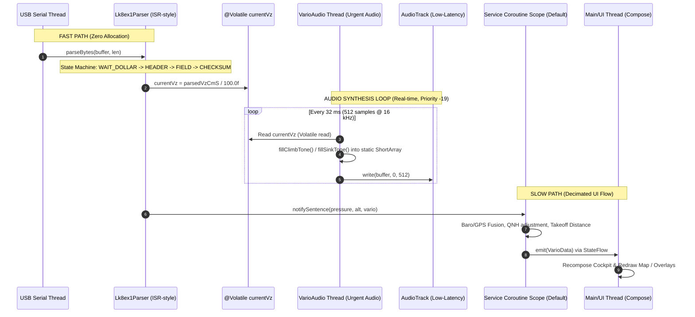
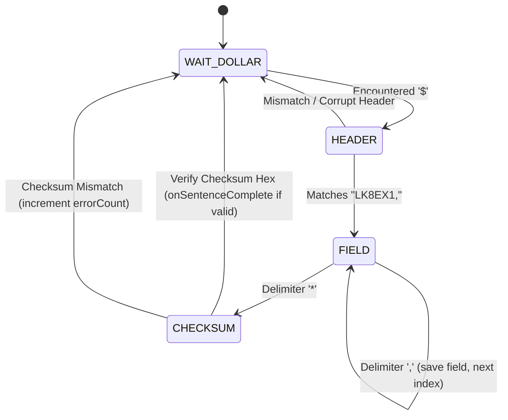
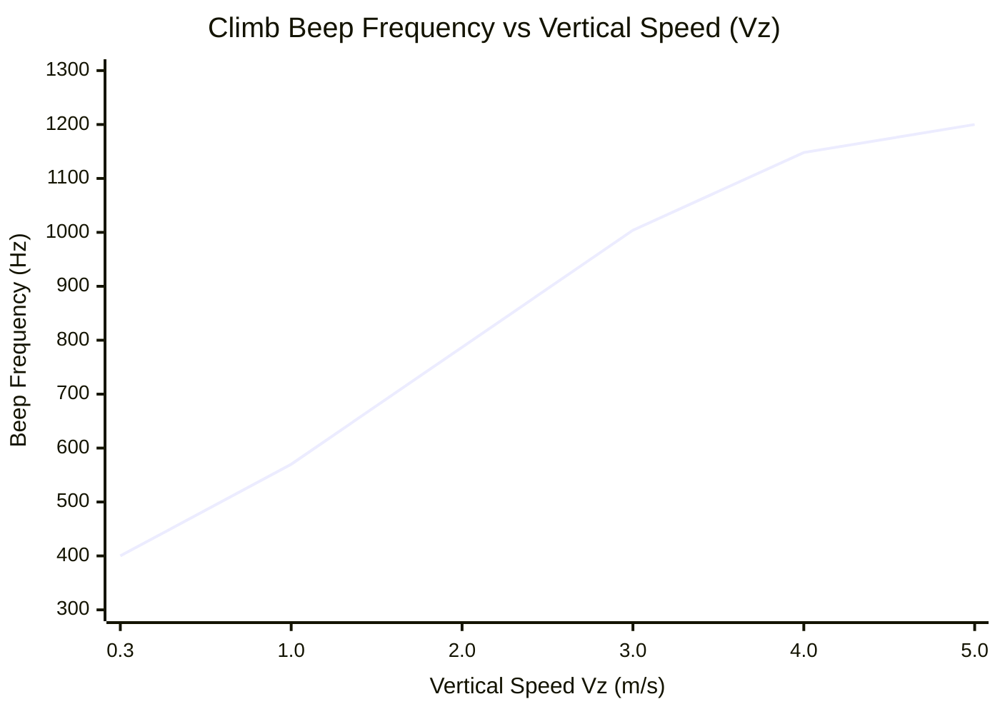
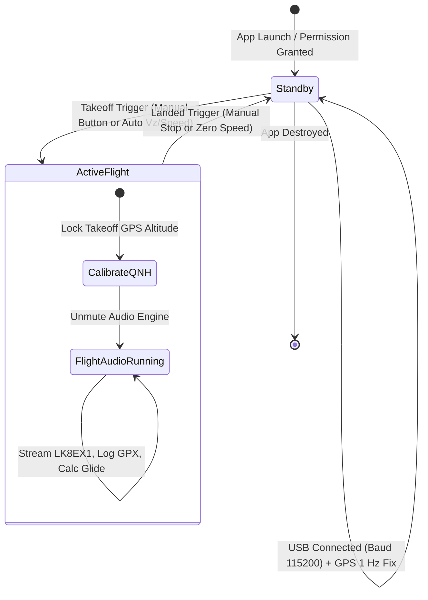
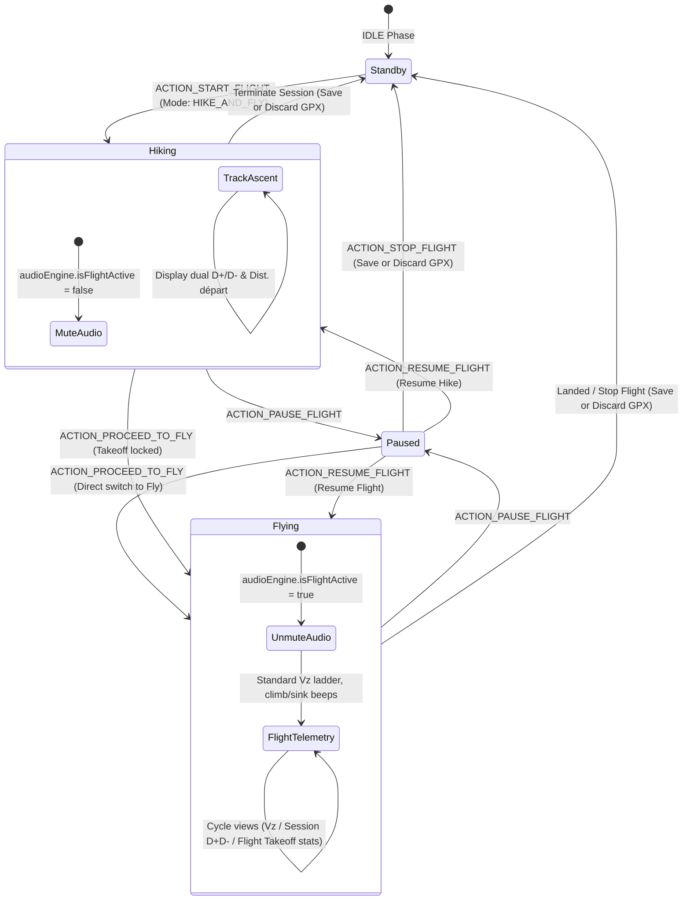

# VarioAppli - System Architecture & Technical Specification

## 1. Executive Summary & Design Principles

**VarioAppli** is a professional-grade Android variometer application designed for paragliding and hang-gliding pilots. It interfaces with an external hardware sensor dongle (SAMD21 ARM Cortex-M0+ microcontroller and Bosch Sensortec BMP390 precision barometric sensor) over USB-OTG using the NMEA-like **LK8EX1** telemetry protocol.

### Core Architectural Mandates
1. **Ultra-Low Latency Audio (< 30 ms):** Thermal lift feedback must reach pilot ears with near-zero acoustic delay to facilitate centering narrow thermals.
2. **Zero Dynamic Allocation on Fast-Path:** The USB byte parsing pipeline and the PCM audio synthesis loop operate with **0 heap allocations (0 bytes allocated/sec)**. This prevents Dalvik/ART Garbage Collection (GC) pauses that would otherwise induce audible clicks, dropouts, or jitter.
3. **Continuous Background Survivability:** The entire telemetry and audio pipeline runs inside an Android `ForegroundService` protected by a `PARTIAL_WAKE_LOCK`, surviving screen lock, Doze mode, and deep sleep.
4. **Decoupled Reactive UI:** The Jetpack Compose cockpit and OSMDroid tactical map observe state exclusively through immutable `StateFlow<VarioData>` emissions, isolating real-time audio and sensor processing from UI rendering or recomposition overhead.

---

## 2. Global System Architecture

```mermaid
flowchart TD
    subgraph HW["Hardware Layer"]
        Dongle["SAMD21 + BMP390 Dongle<br/>(Baro & Thermometer)"]
        GPS["Internal Smartphone GNSS<br/>(GPS / GLONASS / Galileo)"]
    end

    subgraph ServiceLayer["Foreground Service Layer (VarioService)"]
        WakeLock["PARTIAL_WAKE_LOCK<br/>(PowerManager)"]
        USB["usb-serial-for-android<br/>(CdcAcmSerialDriver @ 115200 baud)"]
        Parser["Lk8ex1Parser<br/>(Zero-Allocation State Machine)"]
        FusedGPS["FusedLocationProviderClient<br/>(1 Hz Ground Truth)"]
        VolatileVz["@Volatile currentVz<br/>(Single-word Inter-Thread Handover)"]
        Audio["VarioAudioEngine<br/>(THREAD_PRIORITY_URGENT_AUDIO)"]
        AudioTrack["AudioTrack (16 kHz, Mono PCM)<br/>PERFORMANCE_MODE_LOW_LATENCY"]
        StateEngine["VarioData State Publisher<br/>(StateFlow)"]
    end

    subgraph UILayer["User Interface Layer (Jetpack Compose)"]
        MainActivity["MainActivity Cockpit<br/>(Dual Tab: Vario & Map)"]
        LadderGauge["Dynamic Ladder Gauge<br/>& Digital Vz Readout"]
        MapScreen["MapScreen (osmdroid)<br/>(Moving Glider, Thermal Trail)"]
        NavSubsystem["TerrainElevationProvider (AGL)<br/>ObstacleRoutingEngine (Clearance)<br/>GlideOverlay (Glide Cone Reach)"]
        GpxManager["GpxTrackManager<br/>(GPX Flight Log Recorder)"]
        DebugModal["DebugModal<br/>(LK8EX1 Inspector, NMEA Log, Audio Tone Test)"]
    end

    Dongle -->|Raw Serial Stream| USB
    USB -->|Byte Stream (No GC)| Parser
    Parser -->|Fast-Path Volatile Write| VolatileVz
    VolatileVz -->|Volatile Read| Audio
    Audio -->|Direct PCM Buffer (ShortArray)| AudioTrack
    AudioTrack -->|Acoustic Beeps/Sinks| Speaker["Device Speaker / Bluetooth"]

    GPS -->|Location Updates| FusedGPS
    FusedGPS -->|Takeoff & QNH Calibration| StateEngine
    Parser -->|Decimated Telemetry| StateEngine

    StateEngine -->|StateFlow&lt;VarioData&gt;| MainActivity
    MainActivity --> LadderGauge
    MainActivity --> MapScreen
    MapScreen --> NavSubsystem
    MapScreen --> GpxManager
    MainActivity --> DebugModal
```

---

## 3. Concurrency & Threading Model

The system employs strict thread isolation to decouple real-time audio synthesis from USB I/O, background telemetry, and UI recomposition.



### Thread Descriptions & Priorities
1. **Audio Synthesis Thread (`VarioAudio`):**
   - OS Priority: `Process.THREAD_PRIORITY_URGENT_AUDIO` (-19).
   - Operation: Runs infinite low-jitter loop calling `AudioTrack.write(ShortArray, 0, 512)`.
   - Budget: 512 samples at 16,000 Hz represents **32 milliseconds** of audio. Buffer generation consumes < 0.2 ms of CPU time.
2. **USB Communication Thread:**
   - Managed by `usb-serial-for-android` worker thread.
   - Continuously reads CDC-ACM endpoint chunks (default chunk 256 bytes) and synchronously invokes `Lk8ex1Parser.parseBytes()`.
3. **Service Coroutine Dispatcher (`Dispatchers.Default`):**
   - Computes mathematical conversions (altitude from hypsometric model, QNH, takeoff delta distance, peak ceiling).
   - Manages GPS location callbacks from `FusedLocationProviderClient` at 1 Hz.
4. **Main UI Thread (`Dispatchers.Main`):**
   - Hosts Jetpack Compose lifecycle, handles gestures, and updates hardware canvas for OSMDroid overlays.

---

## 4. Real-Time Zero-Allocation Fast Path

### The Garbage Collection Hazard in Android
In standard Android JVM / ART execution, dynamic object instantiations (`String`, `List`, boxed primitives like `java.lang.Float`, lambdas capturing scope) generate transient heap allocations. When the nursery heap fills, ART invokes garbage collection. Even concurrent GC pauses can introduce 5–15 ms jitter, leading to audio underruns ("clicks" and "pops").

### Zero-Allocation Guarantees
In `Lk8ex1Parser.kt` and `VarioAudioEngine.kt`:
- **No Object Allocations:** The byte stream parser operates on a byte-by-byte finite state machine using only primitive types (`Byte`, `Int`, `Long`, `Float`, `Boolean`).
- **No String Instantiations:** String splitting (`String.split`), regular expressions, and parsing (`String.toLong()`) are strictly prohibited on the fast path. Raw characters are accumulated mathematically: `fieldValue = fieldValue * 10 + (byte - '0')`.
- **Pre-allocated Static Buffers:**
  - Fast-path sentence buffer: `ByteArray(128)` pre-allocated in `Lk8ex1Parser`.
  - Audio generation buffer: `ShortArray(512)` pre-allocated in `VarioAudioEngine`.
- **Volatile Single-Word Synchronization:**
  - Handover of vertical velocity from parser to audio engine occurs via a single primitive `@Volatile var currentVz: Float`.
  - Avoids `ReentrantLock`, `synchronized` blocks, mutexes, and channel/queue allocations.

---

## 5. LK8EX1 Serial Protocol & Parser Specification

### Sentence Structure
The sensor dongle streams standard ASCII sentences conforming to the LK8EX1 specification at default 115,200 baud (configurable to 57600, 38400, 19200, 9600):

```text
$LK8EX1,pressure,altitude,vario,temp,batt*checksum<CR><LF>
```

| Field Index | Name | Unit / Format | Example | Parser Action |
|---|---|---|---|---|
| **Header** | `$LK8EX1` | Fixed 7-byte ASCII identifier | `$LK8EX1` | State transitions to FIELD 0 |
| **0** | `pressure` | Integer in Pascals (Pa) | `97120` | Parsed into `parsedPressure: Long` |
| **1** | `altitude` | Integer in meters (or 99999 if uncalibrated) | `450` or `99999` | Parsed into `parsedAltitude: Long` |
| **2** | `vario` | Signed integer in cm/s (100 = +1.0 m/s) | `+142`, `-85`, `0` | Parsed into `parsedVarioCmS: Long` |
| **3** | `temp` | Temperature in °C × 10 (or 9999 if absent) | `215` (21.5 °C) | Checked & bypassed |
| **4** | `batt` | Battery voltage or status percentage | `415` (4.15 V) | Checked & bypassed |
| **Checksum**| `*XX` | 2-digit Hexadecimal XOR checksum | `*43` | Evaluated against stream XOR accumulator |

### State Machine Implementation


---

## 6. Vario Audio Engine & Acoustic Mapping

### Audio Track Configuration
- **Sample Rate:** 16,000 Hz mono (16-bit signed PCM).
- **Buffer Size:** 512 samples (~32 ms buffer latency at 16 kHz).
- **Attributes:** `USAGE_GAME`, `CONTENT_TYPE_SONIFICATION`, `PERFORMANCE_MODE_LOW_LATENCY`.
- **Amplitude:** 24,000 (~73% of `Short.MAX_VALUE` to avoid speaker saturation and clipping).

### Acoustic Response Curves & Math (`VarioMath.kt`)



1. **Climb Mode ($V_z \ge +0.3\text{ m/s}$):**
   - Generates intermittent beeps (pulse-width modulated sine wave).
   - Frequency: Ramps linearly from **400 Hz** ($V_z = 0.3\text{ m/s}$) to **1,200 Hz** ($V_z \ge 5.0\text{ m/s}$).
   - Duty Cycle (Tone ON ratio): Ramps from **40%** to **85%**.
   - Beep Period: Decreases from **10,667 samples** (~1.5 beeps/sec) down to **2,667 samples** (~6.0 beeps/sec) as lift strengthens.
   - Continuous phase accumulator tracking: $Phase = (Phase + 2\pi \cdot f / 16000) \pmod{2\pi}$ to prevent phase discontinuity clicks.

2. **Sink Alarm Mode ($V_z \le -2.0\text{ m/s}$):**
   - Emits a continuous, urgent descending tone.
   - Frequency: Transitions from **400 Hz** at $-2.0\text{ m/s}$ down to **200 Hz** at severe sink ($-8.0\text{ m/s}$).
   - Duty Cycle: 100% continuous.

3. **Deadband ($ -2.0\text{ m/s} < V_z < +0.3\text{ m/s}$):**
   - Complete silence (zeroed PCM buffer) to maintain pilot focus during normal glide.

---

## 7. Service Lifecycle & Android Power Management



### Doze Mode & WakeLock Strategy
- Android OS aggressively throttles CPU and network when the display shuts off.
- `VarioService` acquires a `PowerManager.PARTIAL_WAKE_LOCK` upon service start and holds it indefinitely while the service is alive.
- The service runs as `ServiceInfo.FOREGROUND_SERVICE_TYPE_LOCATION` (or `CONNECTED_DEVICE` / `SPECIAL_USE` on Android 14+), displaying an ongoing persistent notification showing real-time altitude, Vz, and flight duration.
- The app prompts the pilot for `REQUEST_IGNORE_BATTERY_OPTIMIZATIONS` to bypass manufacturer-specific background task killers (Samsung, Xiaomi, Pixel Adaptive Battery).

---

## 8. Navigation, Terrain Elevation & Airspace Subsystems

### 1. Relief Elevation & AGL Provider (`TerrainElevationProvider.kt`)
- Calculates pilot clearance Above Ground Level ($\text{AGL} = \text{Altitude MSL} - \text{Terrain Elevation}$).
- Backed by an in-memory thread-safe LRU cache (512 tiles, quantized to ~110m grid).
- Automatically fetches digital elevation data asynchronously via the Open-Meteo elevation API, with graceful offline fallback to local regional relief models.

### 2. Obstacle & Airspace Avoidance (`ObstacleRoutingEngine.kt`)
- Maintains geographic definitions of high-risk mountain obstacles (cables, power lines, alpine peaks, restricted airspaces).
- Implements waypoint navigation algorithms computing direct distance, required glide ratio ($L/D$), and avoidance paths when direct vectors intersect obstacle hazard radii.

### 3. Conical Glide Reach Overlay (`GlideOverlay.kt`)
- Visualizes the pilot's realistic glide footprint on the map as a colored polygon.
- Incorporates paraglider polar estimates, current AGL altitude, and safety margins to indicate reachable landing zones.

### 4. Flight Track & GPX Logger (`GpxTrackManager.kt`)
- Records 1 Hz timestamped geographic points with barometric altitude and variometer readings.
- **Mode & Phase Tagging:** Points carry session phase tags (`HIKING` vs `FLYING`) in `<trkpt><extensions><phase>...</phase></extensions>`.
- **GPX Waypoints (`<wpt>`):** Automatically captures mode transition events as standard GPX waypoints:
  - *Départ Rando:* Recorded at start of Hike & Fly session.
  - *Décollage / Vol:* Recorded at the summit/takeoff transition when switching from hike to fly.
  - *Fin Rando / Atterrissage:* Recorded upon landing or session end.
  - Waypoints serialize with `<name>`, `<desc>`, `<time>`, `<sym>`, and `<ele>`, and render as tactical icons on the map.
- **Track Selection & Camera Centering:** When a historical track is selected in `MapScreen.kt`, the map disables live pilot follow mode and smoothly pans + zooms (level 15.0) to the track's starting fix.
- **Track Save Confirmation (`EXTRA_SAVE_TRACK`):** `VarioService.ACTION_STOP_FLIGHT` evaluates the `EXTRA_SAVE_TRACK` boolean passed from the UI confirmation dialog; if false, recorded points are discarded cleanly without disk I/O.
- Emits standard GPX files exportable to XContest, Strava, or Google Earth.
- Colors the map breadcrumb trail in real time (green for thermals/lift, orange/red for sink, grey for zero).

---

## 9. Jetpack Compose Cockpit & Diagnostic Modal

- **`MainActivity.kt`:** Renders the primary flight cockpit using Jetpack Compose with two main views:
  - **VARIO Screen:** Large high-contrast digital Vz, analog climb/sink ladder gauge, QNH altitude, ceiling attained, distance to takeoff, flight timer, and mute toggle.
  - **MAP Screen:** Full-screen vector/raster map with pilot heading arrow, thermal breadcrumbs, glide cone reach, and itinerary planning tools.
- **`DebugModal.kt` & `DebugLogger.kt`:** Built-in engineering diagnostic terminal:
  - Raw LK8EX1 sentence live terminal with ASCII inspection.
  - Frame counter (valid frames vs checksum error count).
  - Dynamic baud rate switcher (`115200`, `57600`, `38400`, `19200`, `9600`).
  - Synthetic audio tone test generator (+1.5 m/s climb, +3.0 m/s climb, -3.0 m/s sink) for acoustic validation on the ground.
  - Direct shortcut to Android Battery Optimization settings.

---

## 10. Hike & Fly Mode Architecture

### Overview & Lifecycle Model
VarioAppli includes a specialized **Hike & Fly** mode (`FlightMode.HIKE_AND_FLY`) allowing pilots to record continuous multi-sport sessions that encompass the uphill hike (approach, mountaineering, skinning) and the paragliding descent in a single GPX flight track:



### Zero-Allocation Audio Suspension & Pause Subsystem
- **During `SessionPhase.HIKING`:**
  - `audioEngine?.isFlightActive` remains `false`.
  - The real-time audio thread (`VarioAudioEngine`) continues filling its pre-allocated `ShortArray(512)` buffer with pure digital silence (0s).
- **During Pause (`isFlightPaused == true`):**
  - Triggered via `ACTION_PAUSE_FLIGHT`. Silences audio immediately (`audioEngine.isFlightActive = false`).
  - Halts the flight duration ticker, track point accumulation in `GpxTrackManager`, and distance/elevation integration.
  - Keeps GPS fixes, USB reception, map navigation, and menus fully responsive for ground resting, planning, or tactical checks.
  - Resumed via `ACTION_RESUME_FLIGHT` (or transition to flight via `ACTION_PROCEED_TO_FLY`).
- **Fast-Path Integrity:** Zero objects, lambdas, or threads are created or destroyed during pause, resume, or phase transitions.

### Cumulative Elevation Gain (D+) & Loss (D-) Filters
Barometric pressure sensor noise or altitude jitter (~0.1 to 0.5 m) can artificially inflate cumulative elevation metrics over long sessions. To ensure clinical accuracy, `VarioService` employs noise-gated math:
- `computeElevationLoss(currentLoss, lastAlt, newAlt, noiseThresholdM = 1.0f)`
- `computeElevationChanges(currentGain, currentLoss, lastAlt, newAlt, noiseThresholdM = 1.0f)`
- If $|Alt_{current} - Alt_{last}| \ge 1.0\text{ m}$, positive deltas increment $D^+$ and negative deltas increment $D^-$, advancing $Alt_{last}$.
- Altitude jitter below the $1.0\text{ m}$ threshold is rejected.

### Cockpit Adaptive Views & Interactive Telemetry
- **Hike Telemetry Phase:**
  - `Plafond` (cloudbase) is replaced with **Allure moyenne** (`Allure moy.`, in `MM'SS" min/km`).
  - `Dist. déco` is dynamically renamed to **`Dist. départ`** (distance from starting trailhead).
  - Main altitude indicator displays dual **`▲ D ± ▼ 🥾`** showing cumulative ascent ($D^+$) and descent ($D^-$) side by side.
- **Flight 3-View Vertical Metric Cycler:**
  - In `FLYING` phase, clicking the vertical speed readout cycles through 3 distinct pages with pagination dot indicators (`● ○ ○`):
    1. **Page 0 (Vario Instantané):** Standard analog ladder gauge + instantaneous $V_z$ readout.
    2. **Page 1 (Dénivelé Total Session):** Total cumulative $D^+$ and $D^-$ since session start (including hike if Hike & Fly, or solo flight climb/sink).
    3. **Page 2 (Statistiques Décollage):** Flight-only stats since flight takeoff ($D^+_{\text{vol}}$, $D^-_{\text{vol}}$, and peak climb rate $V_{z,\max}$).

---

## 11. GPX Track Profile & Interactive Map Scrubber

### Track Profile Engine (`GpxTrackManager.kt`)
When a GPX flight track is loaded or reviewed on the map, `GpxTrackManager.computeTrackProfile(points)` performs a single-pass traversal computing:
- **`TrackProfilePoint` list:** Cumulative ground distance ($d_i = d_{i-1} + \text{haversine}(p_{i-1}, p_i)$), altitude, vertical speed, ground speed, and timestamp.
- **`TrackProfileData` summary:** Total distance, duration, elevation extremes ($Alt_{min}, Alt_{max}$), cumulative climb ($D^+$) and descent ($D^-$), maximum and average speeds, and vertical speed extremes ($V_{z,\max}, V_{z,\min}$).

### Interactive Profile Scrubber & Map Synchronization (`MapScreen.kt`)
1. **Touch Gesture Tracking:** The elevation graph uses Compose `pointerInput` with `detectDragGestures` and `detectTapGestures` to capture touch coordinates $X_{touch} \in [0, W_{graph}]$.
2. **Distance-to-Point Mapping:** The touch ratio $X / W$ maps linearly to cumulative distance $d_{scrub} = \text{ratio} \times d_{total}$. The nearest `TrackProfilePoint` is resolved in $O(\log N)$ or fast linear scan.
3. **Real-Time Map Marker:** The resolved coordinate $(lat, lon)$ is immediately forwarded to an OsmDroid `Marker` (`scrubberMarker`) on the tactical map:
   - Sets marker position to `GeoPoint(lat, lon)`.
   - Smoothly pans the map camera via `mapView.controller.animateTo(geoPoint)`.
   - Displays a floating pill with exact altitude, cumulative distance, and instantaneous $V_z$ directly above the pilot's touch finger.

---

## 12. Automated Testing & Verification Strategy

The codebase contains a comprehensive unit test suite located in `app/src/test/java/com/vario/app/`:

| Test Suite | File | Scope |
|---|---|---|
| **Parser Correctness & Checksum** | `Lk8ex1ParserTest.kt` | Validates standard frames, sign handling, checksum errors, boundary cases. |
| **Real-Time Memory Verification** | `Lk8ex1ParserTest.kt` | Enforces 0 dynamic allocations on `parseByte()` fast path. |
| **Audio Synthesis & Frequencies** | `VarioAudioEngineTest.kt` | Verifies PCM sample generation, climb frequencies, duty cycle timing, sink alarms. |
| **Barometric & QNH Math** | `VarioMathTest.kt` | Validates hypsometric formula, ISA pressure conversions, and QNH calculation. |
| **Map & Navigation Routing** | `MapAndTrackTest.kt` | Validates obstacle avoidance vectors, distance math, and GPX track point creation. |
| **Hardware Replay Simulation** | `UserLogReplayTest.kt` | Replays real-world flight logs through the parser to ensure robustness against malformed serial data. |
